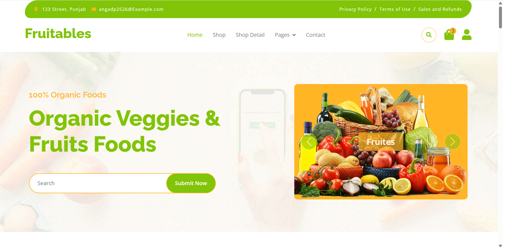
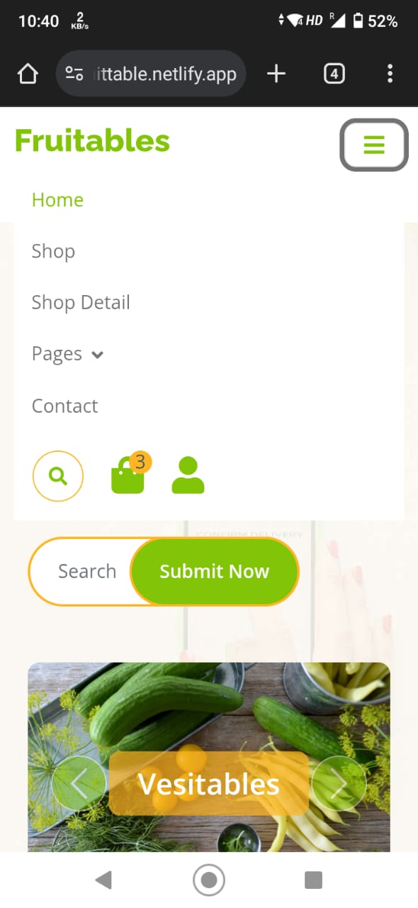

# Fruit & Vegetable Classification Project 🌱🍎

A responsive web application designed to classify and differentiate between various fruits and vegetables using a user-friendly interface. Built with HTML, CSS, JavaScript, and Bootstrap 5, this project works seamlessly across all devices.


## Features ✨
- **Responsive Design**: Works flawlessly on desktops, tablets, and mobile devices.
- **Interactive UI**: Clean and intuitive user interface with dynamic elements.
- **Real-Time Classification**: Instant results based on user input (image/text).
- **Bootstrap Components**: Modern alerts, cards, and responsive navigation bars.
- **Cross-Browser Compatibility**: Tested on Chrome, Firefox, Safari, and Edge.

## Tech Stack 💻
- **Frontend**: HTML5, CSS3, JavaScript (ES6+)
- **Framework**: Bootstrap 5
- **Responsiveness**: Media queries + Bootstrap grid system
- **Build**: Pure vanilla JS (no external dependencies)

## 🌐 Live Demo
Check out the live version here: https://fruittable.netlify.app/


## Usage 🍽️
1. Launch the application
2. Upload an image or enter fruit/vegetable details
3. View instant classification results
4. Explore additional features using the navigation menu

## 📸 Screenshots
#### Desktop View 

#### Mobile View



## Responsive Design Breakdown 📱💻
| Device Type | Layout Behavior                     |
|-------------|-------------------------------------|
| Mobile      | Single-column layout, hidden menu   |
| Tablet      | Adjusted grid system, larger touch targets |
| Desktop     | Multi-column layout, full navigation |

## Contributing 🤝
1. Fork the repository
2. Create your feature branch:
   ```bash
   git checkout -b feature/your-feature
   ```
3. Commit changes:
   ```bash
   git commit -m 'Add some awesome feature'
   ```
4. Push to the branch:
   ```bash
   git push origin feature/your-feature
   ```
5. Open a pull request


## Acknowledgements 🏆
- Bootstrap team for amazing responsive components
- Modern CSS techniques for smooth animations
- Open-source community for valuable resources

## 👤 Author
**Angad Prajapati**  
Instagram: [@angad_prajapati.vision](https://instagram.com/angad_prajapati.vision)